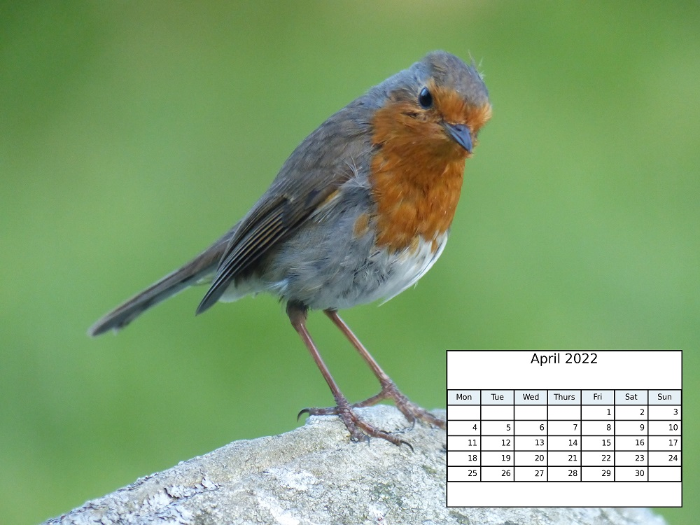

# :calendar: calendizer README

Generates images of calendar month tables and can paste them onto suitable photos.

A quick way to make your own calendar for printing.



## Usage

To generate 12 images of a mini calendar:

`python render_calendar_tables.py <year> <path to output directory>`

To take 12 images and use them to create a calendar:

`python calendize.py <year> <path to directory with 12 images in PNG or JPEG format> <path to output directory>`

For a full list of options, just type the relevant command:

`python render_calendar_tables.py`

`python calendize.py`

### Tips

By default, **calendizer** tries to auto-calculate the DPI and margins.
It uses the table in [CSV format](image_sizes.csv.config) to perform the calculation.

Via the `--dpi` option, you can override this calculation.

With an input image of size 4000 x 3000, these settings seem to work well:

`--dpi 450 -b 100 -r 100`

Settings for other image sizes:

| Image size               | Settings                  |
| ------------------------ | ------------------------- |
| 6000 x 4000 'full frame' | `--dpi 600 -b 150 -r 150` |
| 4000 x 2700              | `--dpi 400 -b 80 -r 80`   |
| 3000 x 2000              | `--dpi 325 -b 60 -r 60`   |
| 2500 x 1800              | `--dpi 250 -b 40 -r 40`   |
| 2300 x 1500              | `--dpi 250 -b 40 -r 40 `  |

There is an alpha (transparency) option:

`-a 0.8`

but printing on a small size like 2L or A5 looks better with the default opaque setting.

Example:

`calendize.py <year> <path to directory with 12 images in PNG or JPEG format> <path to output directory> --dpi 450 -b 100 -r 100`

## Dependencies

- Python 3.x

## Setup

1. Install Python 3.7.x and pip

- Python 3.7.9 or later
- pip 20.2.2 or later

2. Install dependencies

```
pip install -r pip.config
```

## References

https://towardsdatascience.com/simple-little-tables-with-matplotlib-9780ef5d0bc4

# license

License is [MIT](./LICENSE)
